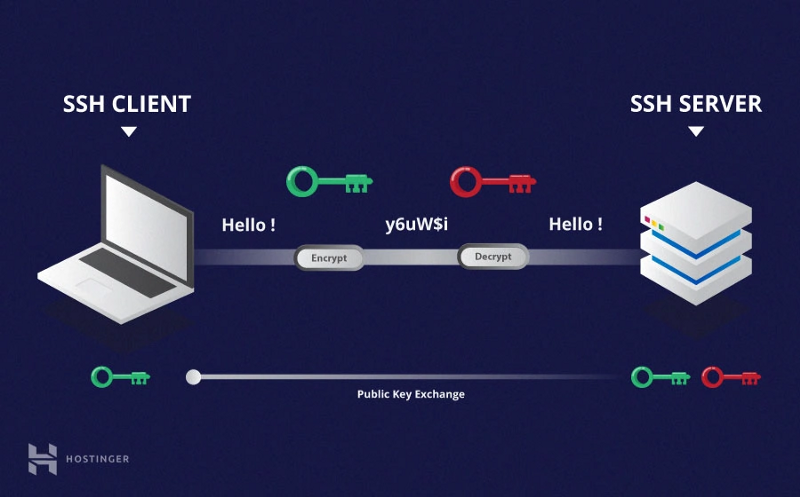

O **SSH** foi desenvolvido com o intuito de habilitar um canal de comunicação segura entre 2 equipamentos, um que faz o papel de cliente **SSH** (origem da conexão) e outro que faz o papel de servidor **SSH** (destino da conexão), utilizando [criptografia de chave pública](https://medium.com/r/?url=https%3A%2F%2Fpt.wikipedia.org%2Fwiki%2FCriptografia_de_chave_p%25C3%25BAblica) ou criptografia assimétrica.


Fonte.: <https://www.hostinger.com.br/tutoriais/como-funciona-o-ssh>

## Uso simples e direto

Para essa etapa vamos utilizar o usuário `ubuntu`{{}}. Utilize o comando abaixo para mudarmos de usuário:

```bash
su - ubuntu
```{{exec}}

> O prompt de comando deve ter alterado para `ubuntu@controlplane:~$`{{}} indicando que agora estamos trabalhando com o usuário `ubuntu`{{}} **ainda no computador** chamado `controlplane`{{}}.

Para logarmos em outro computador (o que faz o papel de servidor **SSH**), com um usuário com o mesmo nome do que está logado localmente, simplesmente usamos o comando abaixo:

```bash
ssh node01
```{{exec}}

```bash
ubuntu@controlplane:~$ ssh node01
The authenticity of host 'node01 (172.30.2.2)' can't be established.
ECDSA key fingerprint is SHA256:OvIkq0qqws0HP70HLCCdX31wLWoI/yvcN+sCCN3Krts.
Are you sure you want to continue connecting (yes/no/[fingerprint])?
```{{}}

Se for a primeira conexão à este computador, será perguntado se queremos armazenar localmente a chave ECDSA deste computador, responda `yes`{{exec}}.

Será apresentada uma mensagem confirmando que a chave ECDSA foi adicionada permanentemente e na sequencia se pede a senha de login do usuário `ubuntu`{{}} no computador `node01`{{}}.

```plain
Warning: Permanently added 'node01,172.30.2.2' (ECDSA) to the list of known hosts.
ubuntu@node01's password:
```{{}}

Informe a senha `ubuntu`{{exec}}.

Por fim é exibida uma mensagem explicando como podemos executar algum comando como o usuário `root`{{}}.

> Agora o prompt de comando deve ser `ubuntu@node01:~$`{{}} indicando que estamos trabalhando com o usuário `ubuntu`{{}} **só que no computador** `node01`{{}}.

No próximo passo vamos criar um usuário comum, neste computador remoto, para utiliza-lo nos nossos exercício. Vamos em frente.
